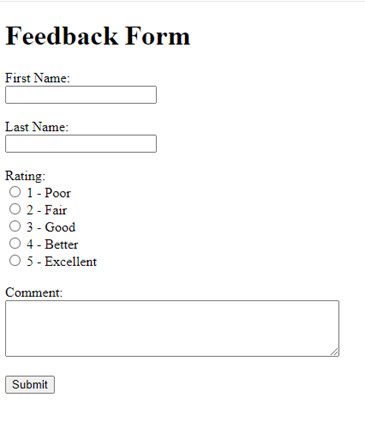
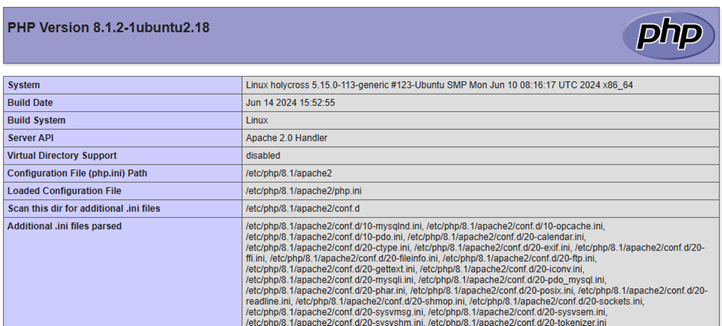
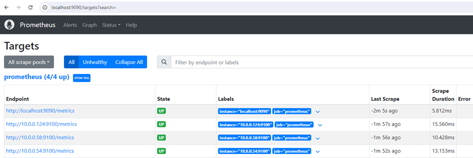

# linuxFeedbackProject
Secure Feedback Collection Website


## Project Overview
The Secure Feedback Project is a simple web application for collecting user feedback. It features a feedback form where users can submit their comments, ratings, and personal information. The application uses OKTA for user authentication and employs the ELK stack for monitoring. Load balancing is handled by HAProxy to ensure high availability.

## Features
- User authentication via OKTA.
- Feedback form for submitting first name, last name, rating, and comments.
- Feedback storage in a MySQL database.
- Display a confirmation message upon successful submission.
- Monitoring of application, server, and network using ELK, Prometheus, and Grafana.
- Load balancing using HAProxy.

## Table of Contents
- [Installation](#installation)
- [Usage](#usage)
- [Project Structure](#project-structure)
- [Configuration](#configuration)
- [Monitoring Setup](#monitoring-setup)
- [Contributing](#contributing)
- [License](#license)

## Installation

### Prerequisites
- Apache Web Server
- MySQL or MariaDB
- PHP
- OKTA account
- ELK stack (Elasticsearch, Logstash, Kibana)
- HAProxy
- Prometheus
- Grafana

### Steps
1. **Clone the repository**

    ```sh
    git clone https://github.com/mie2474/linuxFeedbackProject.git
    cd linuxFeedbackProject
    ```

2. **Set up the Database**

    - Install MySQL.
    ```sh
    sudo apt install mysql-server -y
    ```

    - Secure MySQL and follow the prompt
    ```sh
    sudo mysql_secure_installation
    ```
    - Login to the database
    ```sh
    sudo mysql
    ```
    - Create a database and user:
    ```sql
    CREATE DATABASE linuxPJsolo;
    CREATE USER 'changeme'@'localhost' IDENTIFIED BY 'ChanGeme-1';
    GRANT ALL PRIVILEGES ON linuxPJsolo.* TO 'changeme'@'localhost';
    FLUSH PRIVILEGES;
    ```
    - Login to MySql with the new user data, add password when prompted
    ```sh
    mysql -u changeme -p
    ```
    - Create table in MySQL
    ```sql
    CREATE TABLE feedback (
        id INT AUTO_INCREMENT PRIMARY KEY,
        first_name VARCHAR(50) NOT NULL,
        last_name VARCHAR(50) NOT NULL,
        rating INT NOT NULL,
        comment TEXT NOT NULL,
        entered_date TIMESTAMP DEFAULT CURRENT_TIMESTAMP
    );
    ```


3. **Configure Apache**
    - Install Apache.
    ```sh
    sudo apt install apache2 -y
    sudo systemctl enable apache2
    sudo systemctl start apache2
    ```
    - Verify that Apache is running by typing `localhost` on your browser
    - A similar image would appear
    

    - To create a simple feedback form, go to the index file at `\var\www\html\index.html` and overwrite with
    ```html
    <!DOCTYPE html>
    <html lang="en">
    <head>
        <meta charset="UTF-8">
        <meta name="viewport" content="width=device-width, initial-scale=1.0">
        <title>Feedback Form</title>
    </head>
    <body>
        <h1>Feedback Form</h1>
        <form action="feedback.php" method="post">
            <label for="fname">First Name:</label><br>
            <input type="text" id="fname" name="fname" required><br><br>
            
            <label for="lname">Last Name:</label><br>
            <input type="text" id="lname" name="lname" required><br><br>
            
            <label for="rating">Rating:</label><br>
            <input type="radio" id="rating1" name="rating" value="1" required> 1 - Poor<br>
            <input type="radio" id="rating2" name="rating" value="2" required> 2 - Fair<br>
            <input type="radio" id="rating3" name="rating" value="3" required> 3 - Good<br>
            <input type="radio" id="rating4" name="rating" value="4" required> 4 - Better<br>
            <input type="radio" id="rating5" name="rating" value="5" required> 5 - Excellent<br><br>
            
            <label for="comment">Comment:</label><br>
            <textarea id="comment" name="comment" rows="4" cols="50" required></textarea><br><br>
            
            <input type="submit" value="Submit">
        </form>
    <body>
    <html>
    ```
    - Verify the updated file using by typing `localhost` on your browser
    

4. **Configure PHP**
    - Ensure PHP is installed and configured correctly.
    - Install necessary PHP extensions:
    ```sh
    sudo apt install php libapache2-mod-php php-mysql -y
    ```
    - Create a file <info.php> in `\var\www\html` directory
    ```sh
    sudo vim /var/www/html/info.php
    ```
    - Add the follow to `info.php`
    ```php
    <?php
    phpinfo();
    ?>
    ```
    - Verify PHP is running by opening your browser and type `localhost/info.php`
    - You will see something similar to below
    

5. **Set up OKTA Authentication**
    - Follow OKTA documentation to set up a new application.
    - Configure your application with the provided OKTA client ID and secret.

6. **Configure ELK Stack and HAProxy**
    - Follow ELK and HAProxy documentation for installation and setup.

7. **Set up Prometheus**
    - Install Prometheus:
    ```sh
    wget https://github.com/prometheus/prometheus/releases/download/v2.53.1/prometheus-2.53.1.linux-amd64.tar.gz
    tar -xvf prometheus-2.53.1.linux-amd64.tar.gz
    sudo mv prometheus-2.53.1.linux-amd64 /usr/local/prometheus
    ```
    - Configure Prometheus
    ```sh
    sudo mkdir /etc/prometheus
    sudo mv /usr/local/prometheus/prometheus.yml /etc/prometheus/
    sudo cp /etc/prometheus/prometheus.yml /etc/prometheus/prometheus.yml.backup
    sudo vim /etc/prometheus/prometheus.yml
    ```
    - Configure Prometheus to scrape metrics from your application. Edit the Prometheus configuration file (`/etc/prometheus/prometheus.yml`) to include your application endpoint:
    ```yaml
    scrape_configs:
      - job_name: 'linux_feedback_project'
        static_configs:
          - targets: ['localhost:9090'] # Add as many server - Ensure the servers have node exporter running on each. -targerts: ['localhost:9090','serverA:9100','serverb:9100']
    ```
    - Start Prometheus
    ```sh
    sudo systemctl daemon-reload 
    sudo systemctl enable prometheus
    sudo systemctl start prometheus
    sudo systemctl status prometheus
    ```
    - Verify on your browser by typing `localhost:9090`
    - <h2>NOTE:</h2> Always restart Prometheus after updating (`/etc/prometheus/prometheus.yml`) file
    ```sh
    sudo systemctl restart prometheus
    ```
    - Verify the targets are added and running by navigating Click `Status` --> `Targets`
    

8. **Set up Grafana**
    - Install Grafana:
    ```sh
    sudo apt-get install -y software-properties-common
    sudo add-apt-repository "deb https://packages.grafana.com/oss/deb stable main"
    sudo apt-get update
    sudo apt-get install grafana
    ```
    - Start Grafana:
    ```sh
    sudo systemctl start grafana-server
    sudo systemctl enable grafana-server
    ```
    - Access Grafana at `http://localhost:3000` and log in with the default username (`admin`) and password (`admin`).
    - Add Prometheus as a data source in Grafana:
      - Go to **Configuration > Data Sources > Add data source**.
      - Select Prometheus and set the URL to `http://localhost:9090`.

## Usage
1. **Run the Application**
    - Start the Apache server:
    ```sh
    sudo systemctl start apache2
    ```
    - Access the application at `http://localhost`.

2. **Submit Feedback**
    - Navigate to the feedback form, authenticate using OKTA, and submit your feedback.

## Project Structure
```plaintext
linuxFeedbackProject/
├── index.html
├── feedback.php
├── callback.php
├── .htaccess
├── README.md
└── sql/
    └── create_feedback_table.sql
