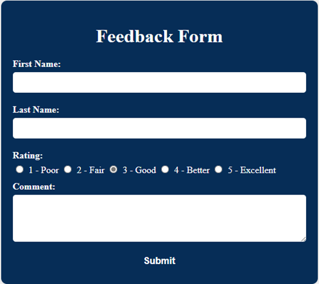
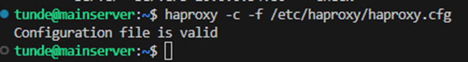
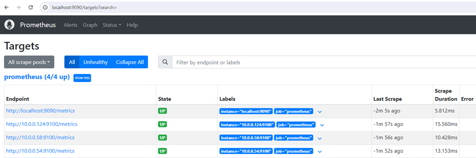
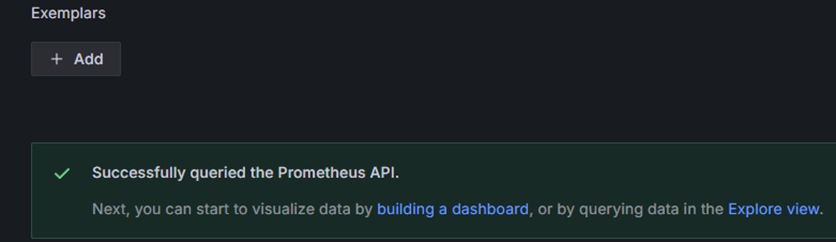
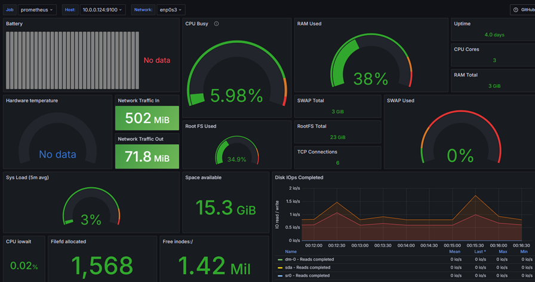

# linuxFeedbackProject
Secure Feedback Collection Website


## Project Overview
The Secure Feedback Project is a simple web application for collecting user feedback. It features a feedback form where users can submit their comments, ratings, and personal information. The application uses OKTA for user authentication and employs the ELK stack for monitoring. Load balancing is handled by HAProxy to ensure high availability.

## Features
- User authentication via OKTA.
- Feedback form for submitting first name, last name, rating, and comments.
- Feedback storage in a MySQL database.
- Display a confirmation message upon successful submission.
- Monitoring of application, server, and network using ELK, Prometheus, and Grafana.
- Load balancing using HAProxy.

## Table of Contents
- [Installation](#installation)
- [Usage](#usage)
- [Project Structure](#project-structure)
- [Configuration](#configuration)
- [Monitoring Setup](#monitoring-setup)
- [Contributing](#contributing)
- [License](#license)

## Installation

### Prerequisites
- Apache Web Server
- MySQL or MariaDB
- PHP
- OKTA account
- ELK stack (Elasticsearch, Logstash, Kibana)
- HAProxy
- Prometheus
- Grafana

### Steps
1. **Clone the repository**

    ```sh
    git clone https://github.com/mie2474/linuxFeedbackProject.git
    cd linuxFeedbackProject
    ```

2. **Set up the Database**

    - Install MySQL.
    ```sh
    sudo apt install mysql-server -y
    ```

    - Secure MySQL and follow the prompt
    ```sh
    sudo mysql_secure_installation
    ```
    - Login to the database
    ```sh
    sudo mysql
    ```
    - Create a database and user:
    ```sql
    CREATE DATABASE linuxPJsolo;
    CREATE USER 'changeme'@'localhost' IDENTIFIED BY 'ChanGeme-1';
    GRANT ALL PRIVILEGES ON linuxPJsolo.* TO 'changeme'@'localhost';
    FLUSH PRIVILEGES;
    ```
    - Login to MySql with the new user data, add password when prompted
    ```sh
    mysql -u changeme -p
    ```
    - Create table in MySQL
    ```sql
    USE linuxPJsolo;
    CREATE TABLE feedback (
        id INT AUTO_INCREMENT PRIMARY KEY,
        first_name VARCHAR(50) NOT NULL,
        last_name VARCHAR(50) NOT NULL,
        rating INT NOT NULL,
        comment TEXT NOT NULL,
        entered_date TIMESTAMP DEFAULT CURRENT_TIMESTAMP
    );
    ```


3. **Configure Apache**
    - Install Apache.
    ```sh
    sudo apt install apache2 -y
    sudo systemctl enable apache2
    sudo systemctl start apache2
    ```
    - Verify that Apache is running by typing `localhost` on your browser
    - A similar image would appear

    

    - To create a simple feedback form, go to the index file at `/var/www/htmlindex.html` and overwrite with
    ```html
    <!DOCTYPE html>
    <html lang="en">
    <head>
        <meta charset="UTF-8">
        <meta name="viewport" content="width=device-width, initial-scale=1.0">
        <title>Feedback Form</title>
    </head>
    <body>
        <h1>Feedback Form</h1>
        <form action="feedback.php" method="post">
            <label for="fname">First Name:</label><br>
            <input type="text" id="fname" name="fname" required><br><br>
            
            <label for="lname">Last Name:</label><br>
            <input type="text" id="lname" name="lname" required><br><br>
            
            <label for="rating">Rating:</label><br>
            <input type="radio" id="rating1" name="rating" value="1" required> 1 - Poor<br>
            <input type="radio" id="rating2" name="rating" value="2" required> 2 - Fair<br>
            <input type="radio" id="rating3" name="rating" value="3" required> 3 - Good<br>
            <input type="radio" id="rating4" name="rating" value="4" required> 4 - Better<br>
            <input type="radio" id="rating5" name="rating" value="5" required> 5 - Excellent<br><br>
            
            <label for="comment">Comment:</label><br>
            <textarea id="comment" name="comment" rows="4" cols="50" required></textarea><br><br>
            
            <input type="submit" value="Submit">
        </form>
    <body>
    <html>
    ```
    - Verify the updated file using by typing `localhost` on your browser.

    

4. **Configure PHP**
    - Ensure PHP is installed and configured correctly.
    - Install necessary PHP extensions:
    ```sh
    sudo apt install php libapache2-mod-php php-mysql -y
    ```
    - Create a file <info.php> in `/var/www/html` directory.
    ```sh
    sudo vim /var/www/html/info.php
    ```
    - Add the follow to `info.php`
    ```php
    <?php
    phpinfo();
    ?>
    ```
    - Verify PHP is running by opening your browser and type `localhost/info.php`
    - You will see something similar to below

    
    - Create PHP files to handle OKTA Authentication
        - Create <callback.php> file in the `/var/www/html` directory and past the contents in the file below into it.
        [callback](callback.php)
        - Create <index.php> file in the `/var/www/html` directory.
        ```sh
        sudo vim /var/www/html/info.php
        ```
        - Copy and paste the contents in the file below into it.
        [index](index.php)
    - Create PHP files to handle the form submission and backend
        - Create <feedback.php> file in the `/var/www/html` directory.
        ```sh
        sudo vim /var/www/html/feedback.php
        ```
        - Copy and paste the contents in the file below into it.
        [feedback](feedback.php)
        - Create <feedcount.php> file in the `/var/www/html` directory.
        ```sh
        sudo vim /var/www/html/feedcount.php
        ```
        - Copy and paste the contents in the file below into it.
        [feedcount](feedcount.php)

5. **Set up OKTA Authentication**
    - Follow OKTA documentation to set up a new application.
        -	Create a Developer OKTA Account
        -	Login to your Admin Console
        -	Navigate to **Applications** > **Applications**
        -	Click Create App Integration
        -	Choose OIDC - OpenID Connect and Web Application
        -	Set the Sign-in redirect URIs to `http://localhost:80/callback.php.`
        -	Set the Sign-out redirect URIs to `http://localhost:80/.`
        -	Click Save and make note of the **Client ID** and **Client Secret**.
    - Configure your application with the provided OKTA client ID and secret in the `/var/www/html` directory
    ```sh
    sudo apt install composer
    ```
    - Install JWT Verifier
    ```sh
    composer require okta/jwt-verifier
    ```
    - Update the `callback.php` file `/var/www/html/callback.php` to add your token url, clientID, and secret key


6. **Configure ELK Stack and HAProxy**
    - Follow ELK and HAProxy documentation for installation and setup.
        
7. **Configure HAProxy**
    - Install HAProxy on the Central/Main server
    ```sh
    sudo apt install haproxy -y
    ```
    - Create a backup HAProxy file
    ```sh
    sudo cp /etc/haproxy/haproxy.cfg /etc/haproxy/haproxy.cfg.old
    ```
    - Update the configuration file by adding below and change the IP as needed.
    ```sh
    frontend main
            bind *:80
            stats uri /haproxy?stats # To check the health and statistics of servers
            default_backend app

    backend static
            balance roundrobin
            server  static  127.0.0.1:4331 check

    backend app
            balance         roundrobin # using roundrobin to balance the traffic.
            server  server1 10.0.0.124:80   check
            server  server2 10.0.0.58:80    check
            server  server3 10.0.0.54:80    check
    ```
    - It may look like this   

    

    - Validate haproxy.cfg after you modified it.
    ```sh
    haproxy -c -f /etc/haproxy/haproxy.cfg
    ```
    - You should get the result below. If you have any errors, check you haproxy.cfg file.

    

    - Start and Enable HAProxy
    ```sh
    sudo systemctl enable haproxy
	sudo systemctl start haproxy
    ```
    - NOTE: Always validate restart HAProxy after modifying the .cfg file
	```sh
    sudo systemctl restart haproxy
    ```
    - Open a web browser and type in `localhost` you should see the content of your webserver. Assume this is <Tab A>
    - Open a new tab on your web browser to check the statistics and health of your webservers and type `http://localhost/haproxy?stats` Assume this is <Tab B>
    - You should see something similar.
    
    - Refresh <Tab A> several times
    - Go to <Tab B> and check the `app` session <LbTot>

8. **Set up Prometheus - On the Central/Main Server**
    - Install Prometheus:
    ```sh
    wget https://github.com/prometheus/prometheus/releases/download/v2.53.1/prometheus-2.53.1.linux-amd64.tar.gz
    tar -xvf prometheus-2.53.1.linux-amd64.tar.gz
    sudo mv prometheus-2.53.1.linux-amd64 /usr/local/prometheus
    ```
    - Configure Prometheus
    ```sh
    sudo mkdir /etc/prometheus
    sudo mv /usr/local/prometheus/prometheus.yml /etc/prometheus/
    sudo cp /etc/prometheus/prometheus.yml /etc/prometheus/prometheus.yml.backup
    sudo vim /etc/prometheus/prometheus.yml
    ```
    - Creat a Systemd Service
        - Create Prometheus user
        ```sh
        sudo useradd --no-create-home --shell /bin/false prometheus
        ```
        - Change ownership of Prometheus File
        ```sh
        sudo chown -R prometheus:prometheus /usr/local/prometheus
        sudo chown -R prometheus:prometheus /etc/prometheus
        ```
        - Create a systemd service file
        ```sh
        sudo vim /etc/systemd/system/prometheus.service
        ```
        - Add the following content to the service file
        ```sh
        [Unit]
        Description=Prometheus
        Wants=network-online.target
        After=network-online.target

        [Service]
        User=prometheus
        Group=prometheus
        Type=simple
        ExecStart=/usr/local/prometheus/prometheus \
            --config.file=/etc/prometheus/prometheus.yml \
            --storage.tsdb.path=/var/lib/prometheus/ \
            --web.console.templates=/usr/local/prometheus/consoles \
            --web.console.libraries=/usr/local/prometheus/console_libraries

        [Install]
        WantedBy=multi-user.target
        ```
        - Create directory for logging
        ```sh
        sudo mkdir -p /var/lib/prometheus
        sudo chown -R prometheus:prometheus /var/lib/prometheus
        ```

    - Configure Prometheus to scrape metrics from your application. Edit the Prometheus configuration file (`/etc/prometheus/prometheus.yml`) to include your application endpoint:
    ```yaml
    scrape_configs:
      - job_name: 'linux_feedback_project'
        static_configs:
          - targets: ['localhost:9090'] # Add as many server - Ensure the servers have node exporter running on each. -targerts: ['localhost:9090','serverA:9100','serverb:9100']
    ```
    - Start Prometheus
    ```sh
    sudo systemctl daemon-reload 
    sudo systemctl enable prometheus
    sudo systemctl start prometheus
    sudo systemctl status prometheus
    ```
    - Verify on your browser by typing `localhost:9090`
    - **NOTE:** Always restart Prometheus after updating (`/etc/prometheus/prometheus.yml`) file
    ```sh
    sudo systemctl restart prometheus
    ```
    - Verify the targets are added and running by navigating Click `Status` --> `Targets`
    

9. **Set up Grafana - On Centra/Main Sever**
    - Install Grafana:
    ```sh
    sudo apt-get install -y adduser libfontconfig1 musl
    wget https://dl.grafana.com/enterprise/release/grafana-enterprise_11.1.3_amd64.deb
    sudo dpkg -i grafana-enterprise_11.1.3_amd64.deb
    ```
    - Start Grafana:
    ```sh
    sudo systemctl daemon-reload
    sudo systemctl enable grafana-server
    sudo systemctl start grafana-server
    ```
    - Access Grafana at `http://localhost:3000` and log in with the default username (`admin`) and password (`admin`). Change the password if you want
    - Add Prometheus as a data source in Grafana:
      - Go to **Configuration > Data Sources > Add data source**.
      - Select Prometheus and set the URL to `http://localhost:9090`.
      - Click `Save & Test` you should get a message like below
      
      - Use Grafana to create dashboards to visualize the performance metrics in real-time.
        - On the dashboard, click `New` and select `Import`
        - Add `14731` to <Find and Import dashbaords>
        - Click `Load`
        - Update the name and select your data source (`prometheus`) then click `Import`
        - A dashboard like below should appear
        

## Usage
1. **Run the Application**
    - Start the Apache server:
    ```sh
    sudo systemctl start apache2
    ```
    - Access the application at `http://localhost`.

2. **Submit Feedback**
    - Navigate to the feedback form, authenticate using OKTA, and submit your feedback.

## Project Structure
```plaintext
linuxFeedbackProject/
├── index.html
├── feedback.php
├── callback.php
├── README.md
├── feedcount.php
└── index.php
